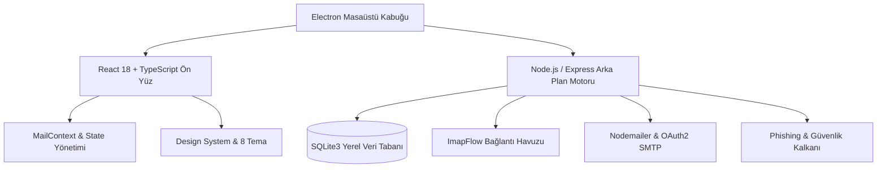

<p align="center">
  
</p>

<h1 align="center">📬 Postacı</h1>

<p align="center">
  <strong>Yeni Nesil, Ultra-Hızlı, Güvenli ve Yapay Zekâ Destekli Açık Kaynak E-Posta İstemcisi</strong>
</p>

<p align="center">
  <em>Modern masaüstü e-posta deneyimini Superhuman ergonomisi, yerel SQLite önbelleklemesi ve akıllı güvenlik kalkanı ile buluşturun.</em>
</p>

<p align="center">
  <a href="https://github.com/eekilinc/Postaci/releases"></a>
  <a href="https://github.com/eekilinc/Postaci/blob/main/LICENSE"></a>
  <a href="https://github.com/eekilinc/Postaci/actions"></a>
  
  
  
  
  
</p>

<p align="center">
  <a href="#-öne-çıkan-özellikler">Özellikler</a> •
  <a href="#-kurulum--indirme">İndir & Kurulum</a> •
  <a href="#-postacı-ai-asistanı">Yapay Zekâ</a> •
  <a href="#-güvenlik--gizlilik-kalkanı">Güvenlik</a> •
  <a href="#-klavye-kısayolları-superhuman-stili">Kısayollar</a> •
  <a href="#-teknoloji-mimarisi">Mimari</a> •
  <a href="#-lisans">Lisans</a>
</p>

---

## 🌟 Öne Çıkan Özellikler

### ⚡ 1. Ultra-Hızlı Asenkron IMAP/SMTP Senkronizasyonu
* **Çok Kanallı Bağlantı Havuzu:** Arka planda eş zamanlı çalışan IMAP/SMTP iş parçacıkları ile sıfır donma veya UI gecikmesi.
* **Yerel SQLite İndeksleme:** Gelen tüm e-postalar yerel SQLite veritabanında önbelleklenir. Binlerce e-posta arasında anında arama ve çevrimdışı okuma imkânı.
* **Canlı SSE (Server-Sent Events) Bildirimleri:** Sunucudaki yeni iletiler, klasör değişiklikleri ve bayrak güncellemeleri anında arayüze yansıtılır.
* **Tam Gmail OAuth2 Desteği:** Şifresiz, güvenli Google OAuth2 yetkilendirmesi ve otomatik jeton yenileme (`refresh_token`).

### 🤖 2. Akıllı Postacı AI Asistanı
* **Otomatik Özetleme:** Uzun iletileri ve karmaşık yazışma zincirlerini saniyeler içinde net özetlere dönüştürür.
* **Görev ve Tarih Ayıklama:** E-postadaki eylemleri, randevuları, toplantı saatlerini ve teslim tarihlerini otomatik tespit eder.
* **Bağlamsal Akıllı Yanıtlar (Smart Replies):** Tek tıkla gönderilmeye hazır, kibar ve profesyonel yanıt önerileri.
* **Katlanabilir / Özelleştirilebilir Panel:** İsteğe bağlı olarak tek tıkla kompakt moda daraltılabilir ve durumu hatırlar.

### 🛡️ 3. Gelişmiş Güvenlik ve Gizlilik Kalkanı
* **Kimlik Avı (Phishing) Algılayıcı:** Şüpheli gönderici adresleri, yanıltıcı alan adları ve gizli yönlendirmeler anında taranıp kullanıcı uyarılır.
* **Görünmez İzleyici Engelleyici (Tracker Blocker):** E-posta pazarlama şirketlerinin okundu bilgisi topladığı 1x1 pikselleri ve web böceklerini otomatik temizler.
* **Harici Görsel Koruma Kalkanı:** İsteğe bağlı görsel yükleme ile IP adresinizin ve konumunuzun ifşa olmasını önler.
* **DOMPurify HTML Temizliği:** XSS ve zararlı JavaScript enjeksiyonlarını sıfıra indirir.

### 🎨 4. Zengin Tema & Kişiselleştirme Ekosistemi
* **8 Özenle Hazırlanmış Tema:**
  * 🌙 **Koyu Titanyum (Dark Titanium)** — Varsayılan modern koyu mod
  * 🖤 **Saf OLED Siyah (Pitch Black)** — Pil dostu, sıfır ışık siyah tema
  * 🌌 **Gece Mavisi (Midnight Slate)** — Derin mor ve lacivert tonlar
  * 🌲 **Siber Zümrüt (Cyber Emerald)** — Matrix ve orman yeşili atmosferi
  * ❄️ **Arktik Ayaz (Nord Frost)** — İskandinav kış esintisi
  * ☀️ **Kar Beyazı (Clean Light)** — Göz yormayan kristal açık mod
  * 📜 **Sıcak Kağıt (Warm Sepia)** — Okuma odaklı nostaljik açık tema
  * 🌸 **Gül Kurusu Pastel (Rose Cream)** — Zarif pastel dokunuş
* **7 Vurgu Rengi:** Mavi, Zümrüt, Mor, Kırmızı, Kehribar, Camgöbeği, İndigo.
* **3 Liste Yoğunluk Modu:** Kompakt, Rahat, Geniş.
* **İkili Görünüm Düzeni:** 3 Sütunlu Yan Yana veya 2 Sütunlu Yatay Bölünmüş Görünüm.

### ⌨️ 5. Superhuman Klavye Ergonomisi & Komut Paleti
* Fareye dokunmadan tüm gelen kutunuzu yönetin.
* `Ctrl + K` / `Cmd + K` ile evrensel komut paletini açın; e-posta arayın, klasör değiştirin, ayarları açın.
* İkili tuş kombinasyonları (`G I`, `G S`, `* A` vb.) ile saniyeler içinde klasörler ve iletiler arasında gezinin.

---

## 📥 Kurulum & İndirme

Postacı'nın en güncel kararlı sürümlerini [GitHub Releases](https://github.com/eekilinc/Postaci/releases) sayfasından indirebilirsiniz.

### 🪟 Windows (x64)
* **Kurulumlu / Taşınabilir Paket:** `Postaci-Setup-1.3.18.exe` veya `.zip` dosyasını indirin ve doğrudan çalıştırın.

### 🐧 Linux (x64)
* **AppImage:** `Postaci-1.3.18.AppImage` dosyasını indirin, çalıştırma izni verin (`chmod +x Postaci-*.AppImage`) ve çift tıklayın.
* **Debian / Ubuntu (.deb):** `sudo dpkg -i Postaci-1.3.18.deb`

---

## ⌨️ Klavye Kısayolları (Superhuman Stili)

| Tuş / Kısayol | Açıklama |
|---|---|
| <kbd>C</kbd> | Yeni E-Posta Yaz (Compose) |
| <kbd>R</kbd> | Seçili E-Postayı Yanıtla |
| <kbd>A</kbd> / <kbd>Shift</kbd> + <kbd>R</kbd> | Tümünü Yanıtla (Reply All) |
| <kbd>F</kbd> | E-Postayı İlet (Forward) |
| <kbd>E</kbd> / <kbd>Y</kbd> | Arşivle |
| <kbd>#</kbd> / <kbd>Del</kbd> | Çöp Kutusuna Taşı / Sil |
| <kbd>S</kbd> | Yıldızla / Yıldızı Kaldır |
| <kbd>U</kbd> | Okundu / Okunmadı Durumunu Değiştir |
| <kbd>J</kbd> / <kbd>↓</kbd> | Bir Sonraki E-Postaya Geç |
| <kbd>K</kbd> / <kbd>↑</kbd> | Bir Önceki E-Postaya Geç |
| <kbd>X</kbd> | E-Postayı Çoklu Seçime Ekle / Çıkar |
| <kbd>G</kbd> ardından <kbd>I</kbd> | Gelen Kutusuna (Inbox) Git |
| <kbd>G</kbd> ardından <kbd>S</kbd> | Yıldızlılara (Starred) Git |
| <kbd>G</kbd> ardından <kbd>T</kbd> | Gönderilenlere (Sent) Git |
| <kbd>G</kbd> ardından <kbd>D</kbd> | Taslaklara (Drafts) Git |
| <kbd>Ctrl</kbd> + <kbd>K</kbd> | **Evrensel Komut Paletini Aç** |
| <kbd>?</kbd> | Kısayol Yardım Penceresini Aç |
| <kbd>Esc</kbd> | Açık Pencere / Modalları Kapat |

---

## 🛠️ Kaynak Koddan Derleme & Geliştirme

### Gereksinimler
* [Node.js](https://nodejs.org/) (v18 veya üzeri)
* [npm](https://www.npmjs.com/) (v9 veya üzeri)
* [Git](https://git-scm.com/)

### 1. Depoyu Klonlayın
```bash
git clone https://github.com/eekilinc/Postaci.git
cd Postaci
npm install
```

### 2. Geliştirme Modunda Başlatın
```bash
npm run dev
```
*Frontend `http://localhost:5173`, Backend `http://localhost:3001` üzerinde çalışacaktır.*

### 3. Masaüstü (Electron) Ortamını Başlatın
```bash
npm run desktop
```

### 4. Masaüstü Paketlerini Derleyin
```bash
# Tüm istemci ve sunucu paketlerini derler:
npm run build

# Windows paketlerini oluşturur (.exe / .zip):
npm run pack:win

# Linux paketlerini oluşturur (.AppImage / .deb):
npm run pack:linux
```

---

## 🏗️ Teknoloji Mimarisi



* **Ön Yüz (Client):** React 18, TypeScript, Tailwind CSS, Vanilla CSS Design Tokens, Lucide Icons, DOMPurify, date-fns.
* **Arka Yüz (Server):** Node.js, Express, better-sqlite3 / sql.js, ImapFlow, Nodemailer, Google APIs.
* **Masaüstü (Desktop):** Electron 31+, Electron Builder, IPC Bridge.

---

## 💾 Yedekleme ve Taşınabilirlik

Postaci, kullanıcı verilerinin tam mülkiyetini garanti eder. **Ayarlar > E-Posta Hesapları** altından:
* Tüm hesap yapılandırmalarınızı, özel klasörlerinizi, imzalarınızı ve tema tercihlerinizi tek tıkla şifreli/güvenli `.json` olarak dışa aktarabilirsiniz (**Export**).
* Başka bir bilgisayarda aynı dosyayı tek tıkla içe aktararak (**Import**) saniyeler içinde çalışmaya devam edebilirsiniz.

---

## 🤝 Katkıda Bulunma

Açık kaynak topluluğunun katkıları Postacı'yı daha iyi bir e-posta istemcisi yapmaktadır:
1. Bu depoyu Fork'layın (`Fork`).
2. Yeni özellik dalınızı oluşturun (`git checkout -b feature/harika-ozellik`).
3. Değişikliklerinizi commit edin (`git commit -m 'feat: harika bir özellik eklendi'`).
4. Dalınıza push yapın (`git push origin feature/harika-ozellik`).
5. Bir **Pull Request (PR)** açın.

---

## 👨‍💻 Geliştirici & İletişim

* **Geliştirici:** **EEKILINC**
* **E-Posta:** [ekilinc@mehmetakif.edu.tr](mailto:ekilinc@mehmetakif.edu.tr)
* **Kurum:** Burdur Mehmet Akif Ersoy Üniversitesi
* **GitHub:** [@eekilinc](https://github.com/eekilinc)
* **Proje Deposu:** [https://github.com/eekilinc/Postaci](https://github.com/eekilinc/Postaci)

---

## 📄 Lisans

Bu proje **[MIT Lisansı](LICENSE)** altında lisanslanmış özgür ve açık kaynaklı bir yazılımdır. Ticari ve kişisel amaçlarla özgürce kullanılabilir, dağıtılabilir ve geliştirilebilir.

<p align="center">
  <em>Postacı ile e-postalarınız her zaman hızlı, güvende ve kontrolünüz altında.</em> 📬
</p>
