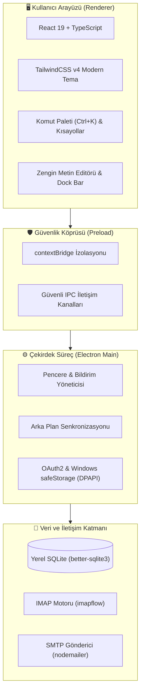

<div align="center">

  <a href="https://github.com/eekilinc/Postaci">
    
  </a>

  # 📮 Postacı

  <p><strong>Yıldırım hızında, yerel SQLite önbellekli, güvenli ve modern masaüstü e-posta istemcisi</strong></p>
  <p><em>A blazing fast, offline-first, modern and secure desktop email client for Windows</em></p>

  <p>
    <a href="https://github.com/eekilinc/Postaci/releases/latest">
      
    </a>
    <a href="https://github.com/eekilinc/Postaci/actions/workflows/release.yml">
      
    </a>
    <a href="https://github.com/eekilinc/Postaci/releases/download/v1.0.1/Postaci.Setup.1.0.1.exe">
      
    </a>
    <a href="https://github.com/eekilinc/Postaci/blob/main/LICENSE">
      
    </a>
  </p>

  <p>
    
    
    
    
    
    
  </p>

  <p>
    <a href="#indir">📥 İndir</a> •
    <a href="#ozellikler">✨ Özellikler</a> •
    <a href="#mimari">🏗️ Sistem Mimarisi</a> •
    <a href="#kisayollar">⌨️ Kısayollar</a> •
    <a href="#gelistirici">🛠️ Geliştirici Kılavuzu</a> •
    <a href="#surumler">🔄 Dağıtım</a> •
    <a href="#guvenlik">🔐 Güvenlik</a>
  </p>

</div>

---

<a id="indir"></a>
## 📥 Hızlı İndirme (Windows x64)

Son sürüm olan **v1.0.1** kurulum paketlerini tek tıkla indirebilirsiniz:

| Paket Türü | Dosya | Boyut | Açıklama |
| :--- | :--- | :--- | :--- |
| 🚀 **Kurulum Sihirbazı (Önerilen)** | [**Postaci.Setup.1.0.1.exe**](https://github.com/eekilinc/Postaci/releases/download/v1.0.1/Postaci.Setup.1.0.1.exe) | ~127 MB | Masaüstü ve Başlat menüsüne simgeli kısayol ekler, otomatik güncellenir. |
| 💼 **Taşınabilir Sürüm (Portable)** | [**Postaci-1.0.1-portable.exe**](https://github.com/eekilinc/Postaci/releases/download/v1.0.1/Postaci-1.0.1-portable.exe) | ~127 MB | Kurulum gerektirmez; USB bellekten veya istediğiniz klasörden doğrudan çalışır. |
| 🔐 **SHA-256 Doğrulama** | [**checksums.txt**](https://github.com/eekilinc/Postaci/releases/download/v1.0.1/checksums.txt) | 187 B | İndirilen dosyaların bütünlük ve güvenlik doğrulama özetleri. |

> [!TIP]
> Tüm geçmiş sürümler ve sürüm notları için **[GitHub Releases](https://github.com/eekilinc/Postaci/releases)** sayfasını ziyaret edebilirsiniz.

---

<a id="ozellikler"></a>
## ✨ Öne Çıkan Özellikler

### ⚡ Yerel SQLite ile Çevrimdışı Kullanım (Offline-First)
- Tüm e-postalarınız, klasör ağacınız ve mesaj meta verileri `better-sqlite3` veritabanında yerel olarak saklanır.
- İnternet bağlantınız kopsa bile gelen kutunuzda **sıfır gecikmeyle arama** yapabilir, e-postalarınızı okuyabilir ve yanıt taslakları hazırlayabilirsiniz.
- İnternet tekrar geldiğinde arka plan eşitlemesi otomatik olarak devreye girer.

### 📬 Çoklu Hesap ve Birleşik Gelen Kutusu (Unified Inbox)
- **Desteklenen Sağlayıcılar:** Gmail, Outlook/Hotmail/Live, Yahoo, iCloud, Yandex ve özel kurumsal IMAP/SMTP sunucuları.
- **Tek Merkez:** Tüm hesaplarınızın gelen kutularını tek bir sayfada birleştiren Birleşik Gelen Kutusu sayesinde hesaplar arasında kaybolmazsınız.

### 🎨 Kusursuz Aydınlık ve Karanlık Tema
- Gözü yormayan modern cam efektleri (glassmorphism), özel renk kontrastları ve net tipografi.
- Koyu ve açık temalar arasında tek tıkla veya kısayolla akıcı geçiş.

### ⌨️ Superhuman Hızında Komut Paleti (`Ctrl + K`)
- Klavyeden elinizi kaldırmadan tüm uygulamayı yönetin:
  - Hesaplar ve klasörler arası anında atlama.
  - Hızlı e-posta arama ve filtreleme.
  - Tema değiştirme, hesap senkronizasyonu ve bildirim testi.

### ↩️ 5 Saniye Geri Alınabilir Gönderim (Undo Send)
- Bir e-postayı yanlışlıkla erken mi gönderdiniz? 
- Gönderim butonuna basıldığında ekranın altında beliren 5 saniyelik geri sayım çubuğu ile gönderimi tek tuşla iptal edebilir ve düzenlemeye kaldığınız yerden devam edebilirsiniz.

### ✍️ Akıllı Taslak & Küçültülebilir Gönderi Penceresi (Dock Bar)
- E-posta hazırlarken gelen kutunuzdaki diğer iletileri incelemek için pencereyi sağ alt köşeye küçültebilirsiniz.
- <kbd>Esc</kbd> tuşuna veya dışarıya yanlışlıkla tıklanması durumunda verileriniz asla silinmez; akıllı taslak koruması devreye girer.

### 🔐 Donanım Seviyesinde Güvenlik (Windows DPAPI)
- Hesap parolalarınız ve OAuth2 erişim anahtarlarınız (Refresh Token) Windows `safeStorage` (DPAPI) ile donanım ve kullanıcı bazında şifrelenir.
- Verileriniz asla üçüncü şahıslarla veya bulut sunucularıyla paylaşılmaz.

### 🔔 Yerel Windows Masaüstü Bildirimleri
- Yeni bir e-posta geldiğinde Windows Bildirim Merkezi'nde Postacı simgesiyle zengin bildirim gösterilir.
- Bildirime tıklandığında Postacı penceresi öne gelir ve doğrudan ilgili e-postayı açar.

---

<a id="mimari"></a>
## 🏗️ Sistem Mimarisi

Postacı, yüksek performans ve güvenlik izolasyonunu bir arada sunan çok katmanlı modern bir masaüstü mimarisine sahiptir:



---

<a id="kisayollar"></a>
## ⌨️ Klavye Kısayolları

Postacı, tam klavye navigasyonunu destekler:

| Kısayol | Kategori | İşlem |
| :--- | :--- | :--- |
| <kbd>Ctrl</kbd> + <kbd>K</kbd> | Genel | **Komut Paletini Aç** (Arama, geçişler, komutlar) |
| <kbd>C</kbd> | E-posta | **Yeni E-posta Yaz** (Compose) |
| <kbd>R</kbd> | E-posta | Seçili e-postayı **Yanıtla** |
| <kbd>A</kbd> | E-posta | Seçili e-postayı **Tümünü Yanıtla** |
| <kbd>F</kbd> | E-posta | Seçili e-postayı **İlet** (Forward) |
| <kbd>Ctrl</kbd> + <kbd>Enter</kbd> | E-posta | Hazırlanan e-postayı **Gönder** |
| <kbd>E</kbd> | Yönetim | Seçili e-postayı **Arşive Taşı** |
| <kbd>#</kbd> veya <kbd>Del</kbd> | Yönetim | Seçili e-postayı **Çöp Kutusuna Gönder** |
| <kbd>S</kbd> | Yönetim | E-postayı **Yıldızla / Yıldızı Kaldır** |
| <kbd>U</kbd> | Yönetim | E-postayı **Okunmadı Olarak İşaretle** |
| <kbd>J</kbd> / <kbd>↓</kbd> | Gezinti | **Sonraki** e-postaya git |
| <kbd>K</kbd> / <kbd>↑</kbd> | Gezinti | **Önceki** e-postaya git |
| <kbd>Esc</kbd> | Genel | Açık pencereleri kapat / Taslağı güvenle kaydet |

---

<a id="gelistirici"></a>
## 🛠️ Geliştirici Kılavuzu

### Ön Gereksinimler
- **Node.js**: v20.x veya üzeri
- **npm**: v10.x veya üzeri
- **İşletim Sistemi**: Windows 10 / 11 (64-bit)

### 1. Depoyu Klonlayın
```bash
git clone https://github.com/eekilinc/Postaci.git
cd Postaci
```

### 2. Bağımlılıkları Kurun
```bash
npm install
```

### 3. Geliştirme Modunda Çalıştırın
Vite HMR dev sunucusunu ve Electron masaüstü uygulamasını eşzamanlı olarak başlatır:
```bash
npm start
```

### 4. Kod Kalite ve Derleme Testi
```bash
# Ultra hızlı Oxlint statik analizi
npm run lint

# TypeScript tip denetimi ve Vite üretim paketi
npm run build
```

### 5. Kurulum Paketini (.exe) Yerel Olarak Üretin
```bash
npm run dist
```
*Derlenen NSIS kurulum ve Portable dosyaları `release/` klasöründe oluşur.*

---

<a id="surumler"></a>
## 🔄 Otomatik Sürüm ve GitHub Dağıtımı

Postacı, GitHub Actions üzerinde tam otomatik bir dağıtım hattına sahiptir:

### Yöntem 1: Komut Satırından Otomatik Sürüm Yükseltme
Terminalinizden tek bir komutla sürümü güncelleyebilir ve GitHub'da derlemeyi başlatabilirsiniz:

```bash
# Hata düzeltme sürümleri için (Örn: 1.0.0 -> 1.0.1)
npm run release:patch

# Yeni özellik sürümleri için (Örn: 1.0.0 -> 1.1.0)
npm run release:minor

# Büyük sürümler için (Örn: 1.0.0 -> 2.0.0)
npm run release:major
```
*Bu işlem `package.json` dosyasını günceller, Git commit ve tag'ini oluşturup GitHub'a gönderir. GitHub Actions derlemeyi otomatik olarak başlatır ve yeni sürümü Releases sekmesine ekler.*

### Yöntem 2: GitHub Arayüzünden Tek Tıkla Release
1. [Postacı GitHub](https://github.com/eekilinc/Postaci) sayfasında **Actions** sekmesine gidin.
2. Sol menüden **Release Postacı** iş akışını seçin.
3. **Run workflow** butonuna tıklayarak sürüm tipini (`patch`, `minor` veya `major`) seçip çalıştırın.

---

<a id="guvenlik"></a>
## 🔐 Güvenlik ve Gizlilik Prensipleri

- 🚫 **Sıfır Bulut İletimi:** E-postalarınız hiçbir harici bulut sunucusuna veya analitik servisine gitmez. Bilgisayarınız ile e-posta sağlayıcınız (IMAP/SMTP) arasında doğrudan ve şifreli (TLS/SSL) iletişim kurulur.
- 🛡️ **Windows DPAPI Şifreleme:** Parolalar ve erişim anahtarları diske açık yazılmaz; Windows `safeStorage` donanım/kullanıcı şifreleme anahtarları ile korunur.
- 🧼 **DOMPurify HTML Sterilizasyonu:** E-posta gövdelerindeki potansiyel zararlı script'ler, iframe ve XSS açıkları temizlenerek güvenle görüntülenir.

---

## 📄 Lisans

Bu proje **[MIT Lisansı](LICENSE)** kapsamında açık kaynaklı olarak geliştirilmektedir.

<div align="center">
  <sub>Geliştirici: <b><a href="https://github.com/eekilinc">Ekrem Eşref Kılınç</a></b> • Mehmet Akif Ersoy Üniversitesi</sub>
</div>
