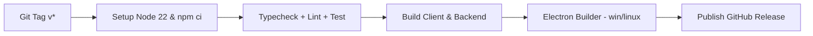

# Postacı — Yerel E-posta İstemcisi 📮

<p align="center">
  
</p>

<p align="center">
  <a href="https://github.com/eekilinc/Postaci/releases/latest"></a>
  <a href="https://github.com/eekilinc/Postaci/actions/workflows/release.yml"></a>
  <a href="https://github.com/eekilinc/Postaci/actions/workflows/ci.yml"></a>
  
  
  
  
</p>

<p align="center">
  <strong>IMAP/SMTP tabanlı, yerel ve güvenli masaüstü e-posta istemcisi.</strong><br>
  React + TypeScript + Express + Electron ile geliştirilmiş, SQLite önbellekli, çok hesaplı ve çevrimdışı çalışabilen Postacı.
</p>

<p align="center">
  <a href="https://github.com/eekilinc/Postaci/releases/latest"><strong>↓ Son Sürümü İndir (v1.4.5)</strong></a>
  · <a href="#-kurulum">Kurulum</a>
  · <a href="CHANGELOG.md">Sürüm Notları</a>
  · <a href="#-hesaplar-ve-google-oauth">OAuth</a>
  · <a href="#-teknik-mimari">Mimari</a>
  · <a href="https://github.com/eekilinc/Postaci/issues">Geri Bildirim</a>
</p>

---

> 📮 **Tamamen Yerel, Güvenli ve Açık Kaynaklı.** E-postalarınız buluta gönderilmez; tüm hesap, imap ve tercih verileri cihazınızda AES-256-GCM ile şifrelenerek saklanır.

---

## 🌟 Neler Sunuyor?

Postacı, tarayıcı tabanlı e-postanın ötesinde, çok hesaplı IMAP senkronizasyonu, sayfalı çevrimdışı önbellek, gönderimi geri alma ve iş akışı entegrasyonu sunar.

| Modül / Özellik | Nasıl Çalışır ve Ne Sağlar? |
|---|---|
| 📧 **Çok Hesaplı IMAP/SMTP** | Gmail, Outlook, Yahoo, iCloud, Yandex ve özel IMAP/SMTP; Google OAuth 2.0 + PKCE veya 16 haneli uygulama şifresi. Otomatik autodiscover. |
| 💾 **SQLite + JSON Çift Önbellek** | Birincil SQLite (`better-sqlite3`), açılamazsa otomatik JSON fallback. `secure_delete=ON`, WAL modu, veri kaybı koruması. |
| 📄 **Sayfalı & Aranabilir Liste** | `{items, hasMore, nextOffset}` ile 500 limit yerine gerçek sayfalama, sunucudan eski iletileri çekme, klasör/etiket/arama sıralaması. |
| 📌 **Kalıcı Sabitleme & Erteleme** | `isPinned` / `snoozedUntil` sunucuda ve senkronizasyonda korunur; açık taslak hesap yenilemesinde kaybolmaz. |
| 🛡️ **İzleyici & Görsel Kalkanı** | `dompurify` + `jsdom` ile izole HTML, takip pikseli ve dış görsel engelleme, güvenli alıntı. |
| ↩️ **5–30sn Gönderimi Geri Al** | `DeliveryGuard` ile idempotent gönderim, çift gönderim koruması, eksik ek & geçersiz alıcı uyarısı. |
| 🔐 **Şifreli Yedek & Geri Yükleme** | Parolalı (≥12 karakter) AES şifreli yedek; kişiler, klasörler, takvim, ekler dahil. Birleştirmeli geri yükleme, 32 MB tek dosya limiti. |
| 🤖 **Kural Tabanlı + Yerel AI** | Varsayılan kural tabanlı özet/yanıt; isteğe bağlı yerel Ollama (`127.0.0.1:11434`) ile özet, akıllı yanıt ve taslak üretimi. Bulut yok. |
| 🎨 **Tema, Yoğunluk & Kısayollar** | Açık/Koyu/sistem tema, vurgu rengi, yoğunluk ve `CommandPalette` kısayolları. |
| 🔔 **SSE Gerçek Zamanlı** | `GET /events` SSE, `emails_synced` / `accounts_updated` anlık bildirim, 25 sn keep-alive ping. |
| 🖥️ **Electron Masaüstü** | `desktop/main.cjs` — IPC, OS keychain, tepsi, otomatik başlatma, `postaci://` OAuth callback protokolü. |
| 🧪 **CI & Paket Testleri** | `npm run check` (typecheck+lint+test), `test:bundle` ve `test:packaged` ile paketli Electron doğrulaması. |

---

## 🎉 1.4.5 ile Gelen Yenilikler

Kalıcı paket korunur; önceki sürümleri kaldırmadan güncelleyebilirsiniz:

- 📄 **E-posta Gövdesi Görünürlüğü Güçlendirildi:** ImapFlow `getMailboxLock` kilitlenme çıkmazı giderildi (`acquireTimeout: 15000`); `GET /api/emails/:id` üzerinde gövde eksik veya sadece özet ise otomatik IMAP tam gövde çekme tetiklendi; `updateEmailBody` URL-encoded/raw/messageId esnek eşleştirmesi eklendi.
- 👁️ **Otomatik Okundu İşaretleme:** Bir ileti açıldığında veya sonraki/önceki mesaja geçildiğinde anında yerel sayaç güncellemesi ve sunucuya `\Seen` bayrağı eşitlemesi sağlandı; kullanıcının manuel "okunmadı" tercihi oturum boyunca korundu; bayrak güncellemelerinde sunucu ağ gecikmelerine karşı hata toleransı sağlandı.
- 🔄 **İçerik Yenileme Düğmesi:** `EmailDetail` içine gövdesi henüz çekilmemiş iletiler için bilgilendirici durum çubuğu ve anında gövdeyi yenileyen "Gövdeyi Yeniden Getir" aksiyonu eklendi.
- ⚡ **Gelişmiş Ön Yükleme:** Gelen kutusu eşitlemesinde en yeni 10 okunmamış ve en yeni 5 genel e-posta gövdesi önceden belleğe alınarak gecikmesiz açılması sağlandı.

---

## 📦 Kurulum

### 1. Kullanıcılar İçin (İndirme)

1. **[Son Sürümü Açın](https://github.com/eekilinc/Postaci/releases/latest)**
2. İşletim sisteminize göre indirin:
   - **Windows:** `Postaci-Setup-1.4.5.exe` (NSIS) veya `Postaci-Setup-1.4.5.zip`
   - **Linux:** `Postaci-1.4.5.AppImage` veya `postaci_1.4.5_amd64.deb`
3. Kurun ve Ayarlar → E-Posta Hesapları’ndan hesabınızı ekleyin.

### 2. Geliştiriciler İçin (Kaynaktan)

#### Gereksinimler:
- Node.js **22.21.1+**, npm, Git
- Electron/SQLite derleme araçları (Windows: Build Tools, Linux: `build-essential` + `python3`)

```bash
# Depoyu klonlayın
git clone https://github.com/eekilinc/Postaci.git
cd Postaci

# Bağımlılıkları yükleyin
npm ci

# Geliştirme (API + Vite + Electron)
npm run dev              # http://127.0.0.1:5173  +  http://127.0.0.1:3001
npm run desktop          # Electron ile birlikte

# Kalite & test
npm run check            # typecheck + lint + test + test:json
npm run build            # istemci + sunucu derlemesi
npm run test:bundle      # derlenmiş sunucuya karşı API testleri
npm run test:packaged    # paketli Electron + SQLite testi
npm run preview          # geçici önizleme (port 3101)
```

#### Paketleme:
```bash
npm run pack:win         # Windows NSIS + ZIP  → dist-desktop/
npm run pack:linux       # Linux AppImage + DEB → dist-desktop/
npm run build:desktop    # --dir (kurmadan test)
```

---

## 🔐 Hesaplar ve Google OAuth

Ayarlar → E-Posta Hesapları → **Yeni Hesap Ekle** → Sağlayıcı seç (Gmail/Outlook/Yahoo/iCloud/Yandex/Özel).

- **Uygulama Şifresi (önerilen):** Gmail için 2 Adımlı Doğrulama → https://myaccount.google.com/apppasswords → 16 haneli şifre. Anında, Google Cloud projesi gerektirmez.
- **OAuth 2.0:** Kendi Google Cloud **Desktop app** istemci kimliğiniz. Giriş sistem tarayıcısında açılır, dönüş `http://127.0.0.1:3001/api/auth/google/callback` (dev) veya masaüstünde rastgele boş port + `postaci://` protokolü.

> Boş bırakılan parola mevcut parolayı korur; API sırları arayüze asla gönderilmez (`publicAccount` maskeleme).

---

## 🧠 Yerel Asistan (Ollama)

Ayarlar → Genel → **Asistan motoru** → `Yerel Ollama` → model adı (örn. `llama3.1:8b`) → Kaydet.

- Ollama `127.0.0.1:11434` üzerinde çalışmalı. Postacı model **indirmez**, buluta bağlanmaz.
- Erişilemezse otomatik kural tabanlı özet/yanıt kullanılır.
- Çıktılar taslaktır — göndermeden önce doğrulayın.

---

## 💾 Yedekleme ve Taşıma

Ayarlar → **Yedekleme & Veri** → en az 12 karakter parola → **Şifreli Yedek Al**.

- İçerik: hesap sırları + OAuth, iletiler/ekler, kişiler, takvim, klasörler, tercihler.
- Geri yükleme **birleştirir**, silmez. Eski şifresiz yedekler okunabilir. İndirilmemiş gövdeler dahil değildir. Tek dosya 32 MB limiti aşarsa açık hata verir.

---

## 🛠️ Teknik Mimari

```
client/src/
├── components/   # EmailList, EmailDetail, Composer, Sidebar, SettingsModal, BackupPanel
├── hooks/        # useEmailCollection (sayfalama), useUndoSend, useComposeInitialization
├── context/      # MailContext (SSE), ThemeContext, ToastContext
└── services/     # api.ts (fetchSafe + session)

server/
├── index.ts      # Express + SSE (+ security, listener)
├── routes/auth.ts# OAuth akışları
└── services/     # db.ts, imapService.ts, smtpService.ts, aiService.ts, backupService.ts, ...

shared/           # mail.ts, preferences.ts, version.ts (ortak sözleşme)
desktop/          # main.cjs, preload.cjs, oauth-protocol.cjs (Electron)
tests/            # api, storage, security, delivery, imap-actions, oauth-*
```

* **IMAP:** `imapflow` ile `INBOX` dahil çekirdek klasörlerin öncelikli senkronu, `getMailboxLock` ile yarış kontrolü, 3 dk posta kutusu önbelleği.
* **Güvenlik:** `installSecurity` (CSP, Origin/Host doğrulama, case-insensitive bypass kapalı), `POSTACI_API_TOKEN` Bearer, yerel oturum (`/api/session`).
* **Veri:** `shared/version.ts` tek kaynak sürüm, `shared/preferences.ts` tercih sözleşmesi, `docs/SECURITY.md` sınırları.

---

## ⚙️ Yapılandırma

| Değişken | Açıklama |
|---|---|
| `PORT` | CLI'da 3001; masaüstünde boş port otomatik |
| `POSTACI_DATA_DIR` | Veri dizini (`./data` varsayılan, Electron’da appData) |
| `POSTACI_STORAGE=json` | JSON saklamayı zorlar |
| `POSTACI_SEED_DEMO=0` | Demo veriyi kapatır |
| `GOOGLE_CLIENT_ID` / `GOOGLE_CLIENT_SECRET` | Sunucu OAuth |
| `POSTACI_AI_MODEL` | Yerel model override |
| `POSTACI_API_TOKEN` | Yerel otomasyon Bearer (paylaşmayın) |

API tek kullanıcı / yerel kullanım içindir. E-posta listeleme `{items, hasMore, nextOffset}` döndürür.

---

## 🤖 GitHub Actions CI/CD

`.github/workflows/ci.yml` — her push/PR’de `ubuntu-latest` + `windows-latest` üzerinde `npm run check` + `build` + `test:bundle`.

`.github/workflows/release.yml` — `v*` tag veya manuel dispatch:



Artifaktlar: `Postaci-Setup-*.exe`, `Postaci-Setup-*.zip`, `Postaci-*.AppImage`, `*.deb` — `generate_release_notes: true`.

---

## 📄 Lisans

Bu proje **[MIT Lisansı](LICENSE)** altındadır. Ticari/kişisel kullanım serbesttir.

---

<p align="center">
  Geliştirici: <strong><a href="https://github.com/eekilinc">Ekrem Eşref Kılınç (@eekilinc)</a></strong><br>
  Made with ❤️ for local-first email
</p>
